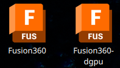
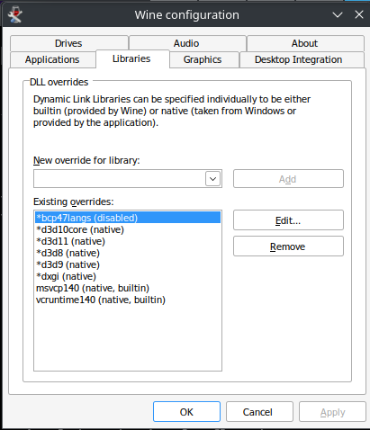

## Script Overview

The script automates the installation and configuration of Fusion 360 on Linux, including necessary dependencies, tweaks, dGPU detection.
Opener script for Autodesk ID Manager authentication is working and its maintainance free, the same goes for Fusion desktop short cuts.

[](https://github.com/str0g/Autodesk-Fusion360-Linux/blob/doc_update/doc/desktop-icons.png)

## How to use

### Dependencies
Required packages
```wine wine-mono wine_gecko winetricks p7zip curl cabextract lib32-gnutls```

Optional
```samba```

### Graphic driver
On the top of the script set DEFAULT_GFX to match your system or go with recommended.

### Installation
Execute and wait around 10 minutes (AMD 5800H and 1Gbit conenction).
```
chmod +x fusion_installer.sh
./fusion_installer.sh
```

### Authorizatoin with Fusion SSO
#### Manual way(fallback mode)
1. After Installation run .fusion/wineprefixes/box-run
2. Click in sing-in banner
3. Default browser should open
4. Login, after redirection click with right mouse button to retry label which contains ```adskidmgr:/login?code=```
5. Save link to .fusion360/cache/login.txt
6. Run ```./fusion_installer.sh auth```
7. Fusion should login.
#### Desktop integrated way
1. After Installation run Fusion dekstop shortcut or to debug in terminal .fusion/wineprefixes/box-run
2. Click in sing-in banner
3. Default browser should open
4. Login, after redirection click sign in button
5. Web browser should start ```adskidmgr.desktop``` (depends on browser you might be ask for permision to open in external application)
6. Fusion should login.

### Folder structure
Script is going to create dir tree (path can be customized)
```
/home/lukasz/.fusion360/
├── cache
│   ├── AdditiveAssistant.bundle-win64.msi
│   ├── AirfoilTools_win64.msi
│   ├── adskidmgr-opener.desktop
│   ├── Fusion360.desktop
│   ├── Fusion360-dgpu.desktop
│   ├── Fusion360installer.exe
│   ├── HelicalGear_win64.msi
│   ├── login.txt
│   ├── MicrosoftEdgeWebView2RuntimeInstallerX64.exe
│   ├── OctoPrint_for_Fusion360-win64.msi
│   ├── ParameterIO_win64.msi
│   └── winetricks
└── wineprefixes
    ├── box-run.sh
[...]
```
### Usage
| **Command**               | **Description**                                                                   |
|---------------------------|-----------------------------------------------------------------------------------|
| `install`                 | Performs installation process, defualt behavior if no peremeters provided.        |
| `update`                  | Backups currect .fusion360 and performs a fresh installation.                     |
| `list_all_tricks`         | Lists all available Winetricks packages for Wine configuration.                   |
| `list_installed_tricks`   | Shows currently installed Winetricks packages.                                    |
| `auth`                    | Attempts to authorize the Fusion 360 installation using credentials.              |
| `experimental`            | Enables experimental performance enhancements (e.g., DXVK or GalliumNine).        | 

### Recovery backup
move backup folder to .fustion360 and execute ```./fusion_installer.sh``` only outcome is going to be coping from cache folder *.desktop files

### Performance
Dxvk give the best performance. OpenGL is a option however read scripts interals first to get knowladge how to modify it. OpenGL enables mesa_glthread for better performance.

### Know issues
- On one machine I had issue with setting up libraries automatically. Libraries should look like on image.

[](https://github.com/str0g/Autodesk-Fusion360-Linux/blob/doc_update/doc/faq-libs-configuration.png)

### Tested on
- ArchLinux with KDE (X11)
- ArchLinux with KDE (Wayland, input does not work correctly, Wine must work directly with Wayland to solve issues)
- ArchLinux with HyprLand (menu redering does not work correctly, input does not work correctly, Wine must work directly with Wayland to solve issues)

### Why this project started?
Every one needs fast, easy to use and maintain solution which just works its only 340 lines of easy maintable code!.

### Special thanks to
Steve Zabka from https://github.com/cryinkfly/Autodesk-Fusion-360-for-Linux 
